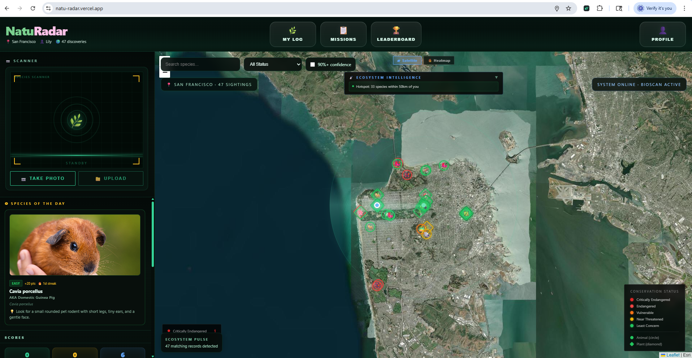
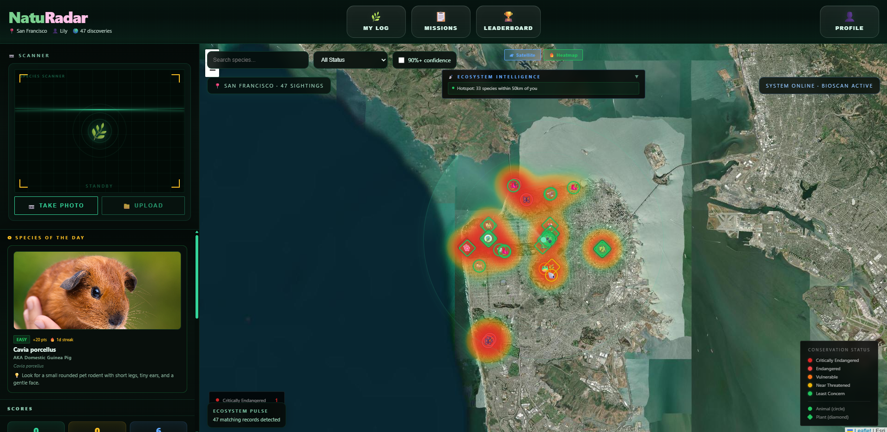
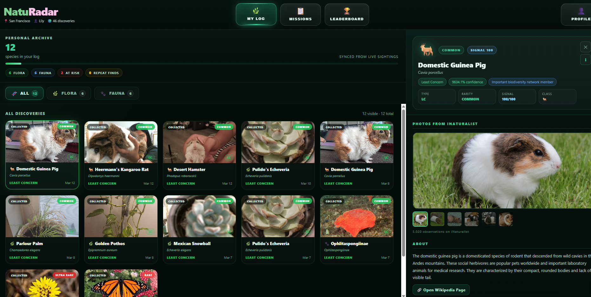
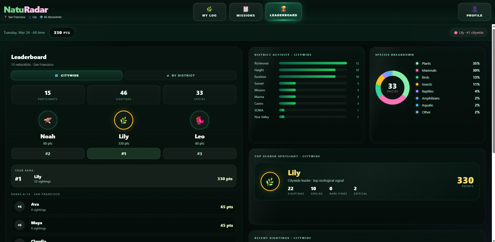
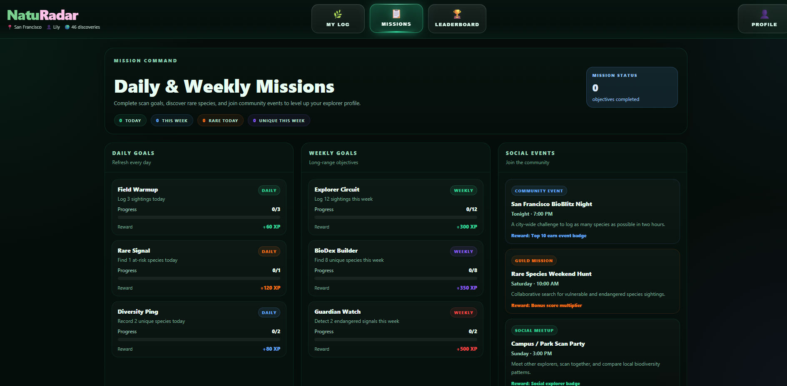
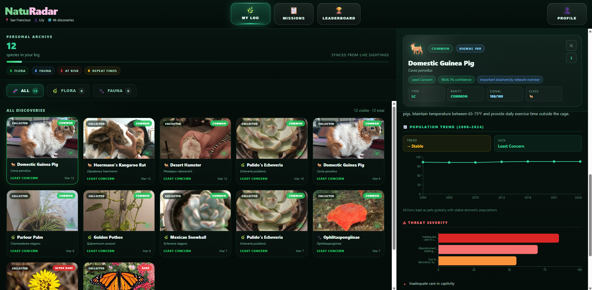

# 🌿 NatuRadar  
**AI-powered, gamified biodiversity discovery platform**

**Live Demo:** [natu-radar.vercel.app](https://natu-radar.vercel.app)

## 🚀 Overview

NatuRadar is a real-time, AI-powered platform that turns everyday exploration into meaningful biodiversity data collection.

Users can scan plants or animals, get instant species identification, and contribute to a growing ecological dataset—while staying engaged through gamification like missions, leaderboards, and rarity-based scoring.

Built **at DonsHack 2026**, where it placed 🏆 **3rd overall**.


## ✨ Features

- 🔍 **Scan & Identify**  
  Upload or capture images to get AI-powered species identification with confidence scores  

- 📍 **Geotagged Logging**  
  Every observation is stored with location, image, and species data  

- 🧬 **BioDex (Personal Collection)**  
  Track and revisit all discovered species  

- 🏆 **Leaderboard**  
  Compete with others based on rarity-weighted scoring  

- 🎯 **Missions**  
  Daily and weekly challenges to encourage real-world exploration  

- 🗺️ **Live Biodiversity Map**  
  Visualize observations and biodiversity density across regions  

- 🔥 **Heatmap Analytics**  
  Identify biodiversity hotspots in real time

## 📸 Screenshots

### 🏠 Home


### 🔥 Heatmap View


### 📊 Analysis Dashboard


### 🏆 Leaderboard


### 🎯 Missions


### 📈 Advanced Insights



## Tech Stack

| Layer | Tech |
|-------|------|
| Frontend | React + Vite |
| Hosting | Vercel |
| External APIs | iNaturalist API · Anthropic Claude API |
| Photo storage | Cloudinary |
| Database | Firebase Firestore |

## Quick Start

**1. Clone and install**
```bash
git clone https://github.com/pj-mohanty/NatuRadar.git
cd NatuRadar
npm install
```

**2. Set up environment variables**
```bash
cp .env.example .env
```

Fill in `.env` with your credentials:

| Variable | Where to get it |
|----------|----------------|
| `ANTHROPIC_API_KEY` | [console.anthropic.com](https://console.anthropic.com) |
| `INAT_TOKEN` | [inaturalist.org/users/api_token](https://www.inaturalist.org/users/api_token) *(expires daily)* |
| `CLOUDINARY_CLOUD_NAME/API_KEY/API_SECRET` | [cloudinary.com](https://cloudinary.com) → Dashboard |
| `VITE_FIREBASE_*` | Firebase Console → Project Settings → Your Apps |

**3. Run locally**
```bash
npm run dev
```

Open [http://localhost:5173](http://localhost:5173)

## Deploy

Push to GitHub, import on [Vercel](https://vercel.com), add the same env vars in project settings. Done.

## Tests

```bash
npm test                 # unit tests
npm run test:integration # real API calls (needs valid env vars)
```

## AI Usage

We used [Claude Code](https://claude.ai/code) by Anthropic as a pair programming assistant throughout development.

## Team

- [Padmaja Mohanty](https://github.com/pj-mohanty)
- [Jonathan Samuel Jayaseelan](https://github.com/Joe2k)
- Pooja Venkatesh
